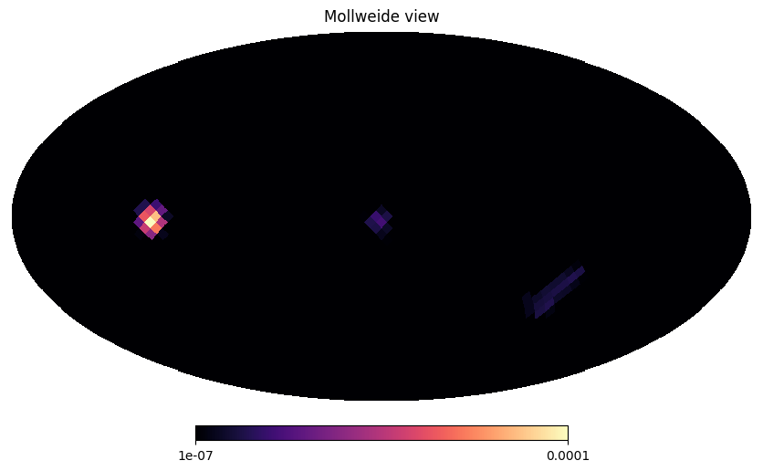

# MPI4py-based Parallel Implementation of the Richardson-Lucy Algorithm
Documentation and code repository for PHYS 244: Parallel Computing

## Directory Contents

- [code](code): contains python scripts for a point-source toy model and $^{44}$Ti imaging analyses.
- [docs](docs): references used to write the code.

## Dependencies
- `numpy`
- `mpi4py`
- `h5py`
- `cosipy` and `histpy` (optional)

## Result
The code successfully recovers the injected signal of 3 supernovae, Cassiopeia A, G1.9+0.3 (Galactic Bulge), and SN1987A (Large Magellanic Cloud) in just 12 seconds. This is a ~20x speed-up with respect to the code in the COSIpy library, which took 3 hours 20 minutes. 
